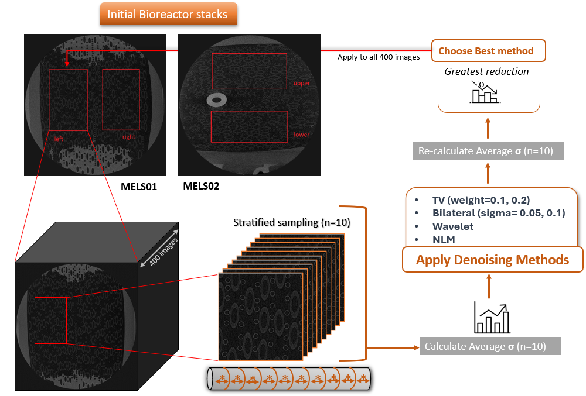
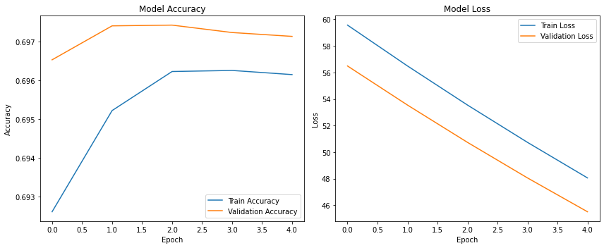
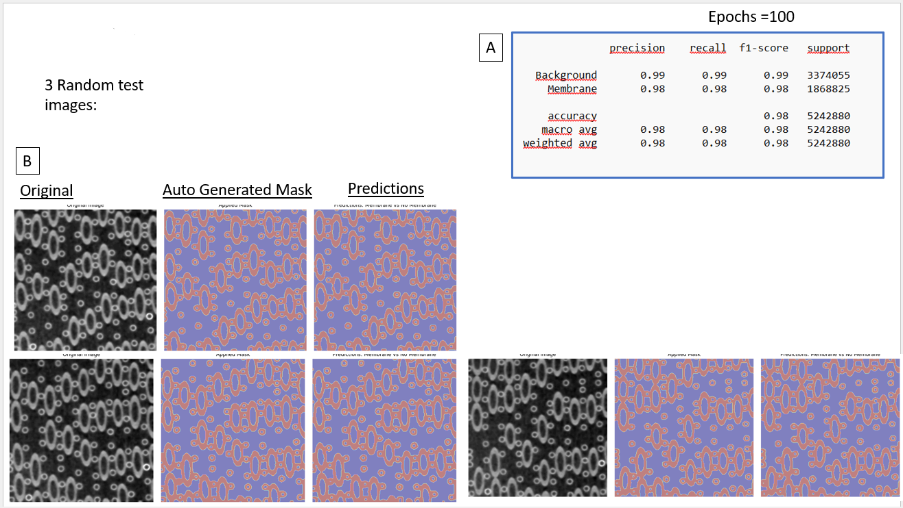
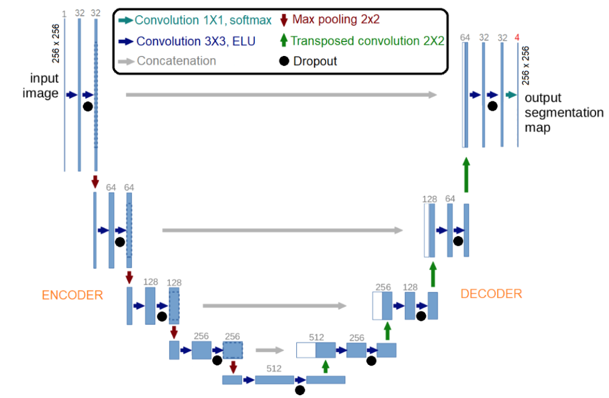
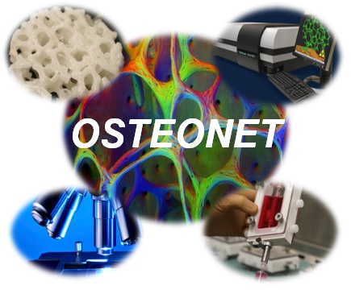

# Bioreactor_Image_Analysis

This repository provides a **comprehensive and customizable image pre-processing pipeline** for high-resolution μCT scans of **Hollow Fiber Membrane Bioreactor (HFMB)** systems.  
The **primary focus of this project is Part 1 (Image Pre-processing)**, which is fully self-contained and can be used independently.  
A **second, optional part** demonstrates how the pre-processed images can be used to train and evaluate a **U-NET convolutional neural network** for segmentation tasks.

The analysis is delivered in a **user-friendly Python notebook**, allowing users to easily modify parameters and adapt the workflow to their own datasets.

> **Notebook:** `final_notebook.ipynb`

---

> ⚠️ **Important notes**
>
> - No exemplary input images can be provided. Please use **your own image folder** containing `.tif` images (recommended).
> - Carefully read the documentation and inline comments in the notebook before modifying parameters, as each step depends on specific data assumptions.
> - Any exemplary images contained in this GitHub repository **are not authorized for reuse**.

---

## Table of Contents
- [Part 1. Image Acquisition and Pre-processing (Core Component)](#part-1-image-acquisition-and-pre-processing-core-component)
  - [1. Image Acquisition](#1-image-acquisition)
  - [2. Volumes of Interest (VOIs)](#2-volumes-of-interest-vois)
  - [3. Pre-processing Pipeline Overview](#3-pre-processing-pipeline-overview)
  - [4. Noise Model and Estimation](#4-noise-model-and-estimation)
  - [5. Edge Smoothing of Membrane Cross-sections](#5-edge-smoothing-of-membrane-cross-sections)
  - [6. Denoising Filter Selection](#6-denoising-filter-selection)
  - [7. Application to Full Image Stack](#7-application-to-full-image-stack)
  - [8. Binarization and 3D Reconstruction](#8-binarization-and-3d-reconstruction)
- [Part 2. Optional: U-NET Segmentation Model](#part-2-optional-u-net-segmentation-model)
- [Acknowledgements](#acknowledgements)
- [Citations](#citations)

---

## Part 1. Image Acquisition and Pre-processing (Core Component)

### Aim

The goal of this part is to **enhance image quality and geometric fidelity** of μCT-derived image stacks of HFMB bioreactors by:

- Reducing **Gaussian noise**
- Improving **contrast**
- Smoothing membrane cross-section edges to enable **accurate 3D reconstruction**
- Automatically selecting the **most effective denoising filter** for each image stack

This pipeline is the **main contribution of the repository** and can be used independently of any machine-learning model.

---

### 1. Image Acquisition

High-resolution μCT images of the 3D membrane network bioreactor ECS were acquired using the **High-Energy CT system Optimized for Research (HECTOR)**, developed by the Ghent University Centre for X-ray Tomography in collaboration with X-Ray Engineering (XRE bvba, Belgium).

- **X-ray source settings**
  - Voltage: **140 kV**
  - Current: **71 μA**

- **Image characteristics**
  - Raw 2D grayscale images of bioreactor cross-sections
  - Acquired on planes orthogonal to the membrane mats (y–z plane)
  - Images collected at:
    - The middle of the bioreactor
    - Both ends of the bioreactor (`n = 3` locations)

- **Voxel resolution**
  - Isotropic voxel size: **93–103 μm³**

> The raw images are typically affected by **high noise levels** and **poor contrast**, making dedicated pre-processing essential.

---

### 2. Volumes of Interest (VOIs)

To ensure representative structural analysis:

- Four **cuboid Volumes of Interest (VOIs)** were reconstructed in the **middle region** of each bioreactor
- VOIs were:
  - Aligned with membrane mats (x-direction)
  - Size:
    - **34.2 mm²** square cross-section
    - **3.7 mm** length
- Each VOI contained approximately **400 consecutive 2D images**

Two VOIs were selected per bioreactor in **symmetrical positions** relative to the sagittal plane.

---

### 3. Pre-processing Pipeline Overview

The image pre-processing pipeline consists of the following stages:

1. **Image subset selection**
2. **Noise estimation**
3. **Edge smoothing of membrane cross-sections**
4. **Comparison of denoising filters**
5. **Automatic filter selection**
6. **Application to full image stack**
7. **Binarization**
8. **3D reconstruction**

The workflow is summarized in *Figure 1*.

*Figure 1. Image pre-processing workflow applied to a representative HFMB image stack.*

---

### 4. Noise Model and Estimation

The noise originating from the μCT acquisition system is assumed to follow a **Gaussian (normal) distribution**, commonly used for X-ray imaging systems.

The probability density function is defined as:

#### Gaussian Noise Distribution

$$
G(h) = \frac{1}{\sigma \sqrt{2\pi}} \exp\left(-\frac{(h - \mu)^2}{2\sigma^2}\right)
$$

where:
- **h** is the additive noise
- **μ** is the mean gray value
- **σ** is the standard deviation of the noise

The parameter **σ** quantifies noise strength and is used as the **objective metric** to evaluate denoising performance.

---

### 5. Edge Smoothing of Membrane Cross-sections

To prevent irregular membrane boundaries in subsequent 3D reconstruction:

- A **binary mask** of the membrane ring-like structures was created
- **Otsu’s thresholding** was applied to separate:
  - Membranes (foreground)
  - Background
- **Gaussian Blur** (OpenCV) was applied **only to membrane regions**
- Smoothed membranes were recombined with the original background

This selective smoothing preserves structural integrity while reducing edge artifacts.

---

### 6. Denoising Filter Selection

To identify the most effective denoising method:

- **10 images** were randomly selected from each 400-image stack using **stratified sampling**
- Each image was processed using the following filters:

> #### Evaluated Denoising Filters
>
> - **Total Variation (TV)**  
>   - Weights: `0.1`, `0.2`
>
> - **Bilateral Filter**  
>   - σ values: `0.05`, `0.1`
>
> - **Wavelet Denoising**
>
> - **Non-Local Means (NLM)**

Each filter was evaluated by measuring the **reduction in σ** relative to the raw images.

> ✅ The filter achieving the **largest average reduction in σ** was automatically selected.

---

### 7. Application to Full Image Stack

Once the optimal denoising filter was identified:

- The same **smoothing + denoising procedure** was applied to **all images** in the VOI stack
- This ensured **consistency** and **reproducibility** across the dataset

All algorithms were implemented in **Python**, using:

- `scikit-image`
- `OpenCV`

---

### 8. Binarization and 3D Reconstruction

After pre-processing:

- Images were **binarized** in **ImageJ** using:
  - Threshold value: **33** (grayscale range 0–255)
- This allowed clear discrimination between:
  - Solid membrane material
  - Voids (pores)
- The **3D architecture** of each VOI was reconstructed in ImageJ

Structural parameters were then quantified either:
- Within VOIs, or
- On planar ROIs at regular distances from the VOI boundaries

---

## Part 2. Optional: U-NET Segmentation Model

> 🔹 **This part is optional and depends on Part 1 outputs**

This section demonstrates how the pre-processed images can be used to train and test a **U-NET convolutional neural network** for segmentation of membrane structures from background.

- Dataset split into **training** and **testing**
- Training metrics:
  - Accuracy
  - Loss (training & validation)
- Testing metrics:
  - Precision
  - Recall
  - F1-score
  - Support
- Visualization of predictions on random test samples

*Figure 2. Training and validation metrics.*

*Figure 3. Quantitative and qualitative test results.*

The U-NET architecture was originally designed by **Aritz Lizoain Cotanda** and adapted here for HFMB image segmentation.

*Figure 4. U-NET architecture.*

---

## Acknowledgements

This work is part of the **OSTEONET HORIZON-MSCA-2021 Project**  
**Grant Agreement No. 101086329**

---

## Citations

1. Lizoain Cotanda, A. *Application of machine learning techniques to images collected with Charge Coupled Devices to search for Dark Matter*. 2020.  
   http://hdl.handle.net/10902/20627

2. CNN-Image-Segmentation GitHub repository:  
   https://github.com/aritzLizoain/CNN-Image-Segmentation
