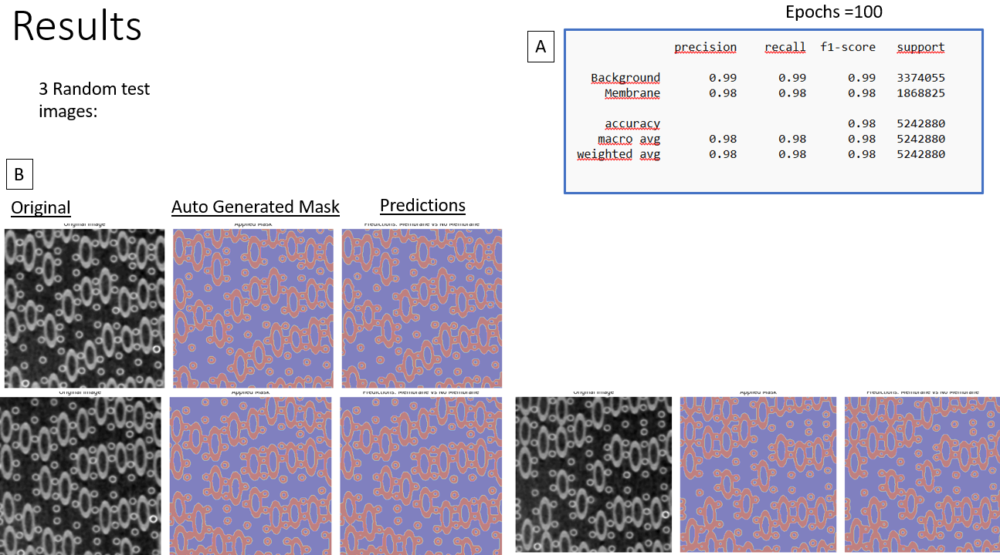

# Bioreactor_Image_Analysis

This project has a dual aim. The first part consists of a detailed pipeline for preprocessing images derived from μCT scan of HFMB bioreactors.On the second part a CNN model (U-NET) is applied for segmentation analysis of the images provided on the first part. The analysis is offered in a user-friendly Python notebook format, where the user can adjust variables in the script and customise the analysis. 

The notebook is titled 'final_notebook.ipynb'

! We cannot provide exemplary input images at the moment. Please use your own in .tif format (See 'Acknowledgements')
! Please read the documentation on the scrit carefully in order to understand the data used in each step if you want to adjust them according to your aims

### Table of Contents
- [Part 1. Preprocess stack of images: Denoise and Smooth edges](#part-1-preprocess-stack-of-images-denoise-and-smooth-edges)
- [Part 2. Apply U-NET model](#part-2-apply-u-net-model)
- [Acknowledgements](#acknowledgements)
- [Citations](#citations)

## Part 1. Preprocess stack of images: Denoise and Smooth edges

The aim of this preprocessing procedure was the application of state-of-the-art denoising techniques in image stacks derived from two HFMBs. Furthermore, another aim is the smoothing of the cross-sections of the fiber membranes was performed in order to secure accurate 3D bioreactor reconstruction. The pipeline pinpoints the most appropriate of these methods for each image stack, according to which method achieved the greatest reduction in Gaussian noise metrics. Then this method is applied to all the images in the stack.

The workflow of the procedure is detailed below in *Figure 1* for the example of "MELS01 left" stack of 400 images.

*Figure 1*

## Part 2. Apply U-NET model
This part aims in training and testing a U-NET model based on the preprocessed images from Part 1. The segmentation problem aims in discriminating between hollow fiber membrane structures in greyscale μCT scan images of HFMBs, and their background.For this purpose the dataset is split into training and testing. For training the metrics are presented by plotting the Accuracy and Loss for each epoch, for training and validation sets, as shown in *Figure 2*. For the testing, Precision, Recall, F-1 score and Support metrics are provided as shown in *Figure 3A*. Also we provide a visualization example (*Figure 3B*) of 3 random test images, where they show the original image, the applied mask and the model's predictions.

*Figure 2*

*Figure 3*

 The model's architecture is designed by Aritz Lizoain Cotanda1 and implemented for segmentation of dark matter particle signals among background noise. The model's architecture is detailed below in *Figure 4* (image derived for corresponding GitHub2):

*Figure 4*

## Acknowledgements

This work is part of the OSTEONET HORIZON-MSCA 2021 Project
(OSTEONET - HORIZON-MSCA-2021-SE-01GA n. 101086329)

! We do not authorise the use any exemplary images contained in this GitHub !
## Citations

1 Lizoain Cotanda, A. Application of machine learning techniques to images collected with Charge Coupled Devices to search for Dark Matter. (2020, September) [Online]. Available: http://hdl.handle.net/10902/20627.

2 GitHub link: https://github.com/aritzLizoain/CNN-Image-Segmentation